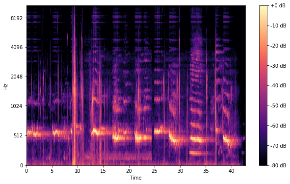

# Audio-Classification



Hello! Here is my personal submission for an multi-class audio classification task for Brainhack's [Today-I-Learn](https://www.dsta.gov.sg/brainhack) hackathon.

My implementation makes use of the Long-Short-Term Memory Recurrent Neural Network [(LSTM-RNN)](https://static.googleusercontent.com/media/research.google.com/en//pubs/archive/43905.pdf), by converting .wav files into [MelSpectrograms](https://medium.com/analytics-vidhya/understanding-the-mel-spectrogram-fca2afa2ce53) (image above) to feed into the Recurrent Neural Network.

Through robust augmentations and hyperparameter tuning, I was able to achieve an average accuracy of 89% on unseen audios.

# Use my implementation
### Cloning the Repository
- Visit the [repository](https://github.com/raythx98/Audio-Classification)
- Click on `Audio Classification.ipynb`
- Click on the download button

### Upload the Jupyter Notebook
- Upload the Jupyter Notebook to your google drive
- Note: `/content/drive/MyDrive` is your google drive home directory
- Open the Jupyter Notebook
- Change your runtime by following these steps
    1. Click on `runtime`
    2. Click on `change runtime type`
    3. Change hardware accelerator to `GPU`

### Configure the Notebook
- Open the Jupyter Notebook
- Under `Importing dataset from Google Drive`, change `base_folder` to your desired path
- rename the zip file for `training_path` and `test_path`, more on creating your dataset [below](#creating-your-datasets)

### Creating your datasets

Your datasets `training_dataset.zip` and `test_dataset.zip` should follow the following format:

```
training_dataset.zip
    training_dataset/
        bird/
            bird_0000.wav
            bird_0001.wav
            bird_0002.wav
            ...
        falcon/
            falcon_0000.wav
            falcon_0001.wav
            falcon_0002.wav
            ...
        {word}/
            {word}_0000.wav
            {word}_0001.wav
            {word}_0002.wav
            ...
        ... 
  
test_dataset.zip  
    test_dataset/
        test_0000.wav
        test_0001.wav
        test_0002.wav
        ...
```
> Please name `{word}` properly, since these will appear in the predictions.

### Final Steps

1. Save the changes you have made till now

2. Upload `training_dataset.zip` and `test_dataset.zip` into `base_folder`

3. Click on `Runtime` then `Run All`
